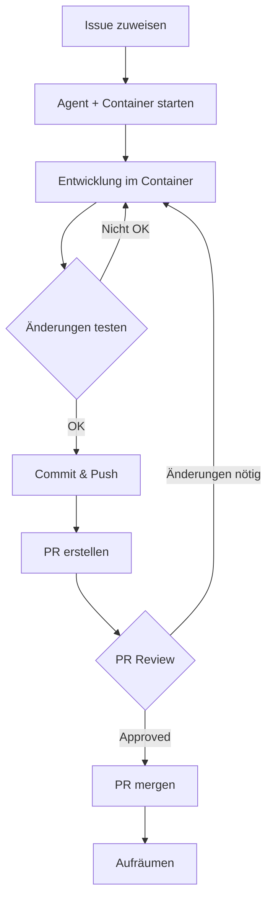

# Docker Multi-Agent Issue-Workflow - Kompletter Ablauf

## 🎯 Übersicht des Wunsch-Workflows

Dieser Workflow beschreibt den kompletten Ablauf vom Issue-Start bis zum PR-Merge mit automatischen Container-Updates und Live-Testing.



## 📋 Schritt-für-Schritt Anleitung

### Phase 1: Issue-Start und Setup

#### 1.1 Issue an Claude zuweisen

```bash
# In deinem Terminal
cd ~/git/github/andrekirst/booking

# Claude Session starten
claude

# Issue zuweisen
> "Arbeite an Issue #75 - Implementiere User-Dashboard"
```

#### 1.2 Claude startet automatisch Agent + Container

Claude führt aus:
```bash
# 1. Prüft verfügbare Agenten
./scripts/status-agents.sh

# 2. Wählt freien Agent (z.B. Agent 2)
# 3. Startet Container mit Issue-Branch
./scripts/start-agent.sh 2 feat/75-user-dashboard

# 4. Wechselt zum Worktree
cd ../booking-agent2
```

**Ergebnis**: 
- Frontend läuft auf http://localhost:60201
- Backend läuft auf http://localhost:60202
- Datenbank läuft auf localhost:60203

### Phase 2: Entwicklung mit Live-Updates

#### 2.1 Claude implementiert Features

```bash
# Claude arbeitet im Worktree
cd ../booking-agent2

# Macht Änderungen, z.B.:
# - Erstellt neue Komponente
# - Updated API Endpoints
# - Fügt Tests hinzu
```

#### 2.2 Automatische Container-Updates (Hot-Reload)

**Frontend-Änderungen** (Next.js):
```bash
# Claude ändert z.B. app/page.tsx
echo "Dashboard Update" >> src/frontend/app/page.tsx

# → Änderung SOFORT sichtbar in http://localhost:60201
# Kein manueller Reload nötig!
```

**Backend-Änderungen** (.NET):
```bash
# Claude ändert z.B. Controller
vim src/backend/Booking.Api/Controllers/DashboardController.cs

# → .NET Hot-Reload übernimmt Änderungen automatisch
# API sofort unter http://localhost:60202/api/dashboard verfügbar
```

#### 2.3 Testen während der Entwicklung

**Du testest parallel:**
1. Browser offen mit http://localhost:60201
2. API-Tests mit curl/Postman auf http://localhost:60202
3. Feedback an Claude: "Das Dashboard fehlt noch X" oder "API gibt falsches Format zurück"

**Claude reagiert:**
```bash
# Nimmt Feedback auf und passt Code an
# Hot-Reload zeigt Änderungen sofort
# Du kannst live mittesten
```

### Phase 3: Manuelle Änderungen synchronisieren

#### 3.1 Wenn DU Änderungen machst

**Szenario**: Du willst selbst etwas anpassen

```bash
# In deiner IDE/Terminal
cd ../booking-agent2/src/frontend
code .  # Öffne VS Code

# Du änderst z.B. Styles
vim app/globals.css
# Speichern → Hot-Reload → Sofort im Browser sichtbar
```

#### 3.2 Claude übernimmt deine Änderungen

```bash
# Du sagst Claude:
> "Ich habe die Styles angepasst, bitte übernimm das in deinen Kontext"

# Claude führt aus:
git status  # Sieht deine Änderungen
git add -p  # Reviewed Änderungen
git commit -m "style: update dashboard styles per user feedback"
```

#### 3.3 Sync bei größeren manuellen Änderungen

Wenn Container-Neustart nötig (z.B. neue Dependencies):

```bash
# Nach package.json Änderung
docker-compose -f docker-compose.agent2.yml restart frontend-agent2

# Nach .NET Package Änderung
docker-compose -f docker-compose.agent2.yml restart backend-agent2

# Oder komplett neu bauen
docker-compose -f docker-compose.agent2.yml up -d --build
```

### Phase 4: Issue-Abschluss

#### 4.1 Finale Tests

```bash
# Claude führt Tests aus
cd ../booking-agent2

# Frontend Tests
cd src/frontend && npm test

# Backend Tests  
cd src/backend && dotnet test

# E2E Tests im Container
docker-compose -f docker-compose.agent2.yml exec frontend-agent2 npm run test:e2e
```

#### 4.2 Commits und Push

```bash
# Claude committed alle Änderungen
git add .
git commit -m "feat: implement user dashboard with live stats

- Add dashboard component with real-time updates
- Create API endpoints for dashboard data
- Add comprehensive test coverage
- Implement responsive design

Fixes #75"

# Push zum Remote
git push origin feat/75-user-dashboard
```

#### 4.3 PR erstellen

```bash
# Claude erstellt PR
gh pr create --title "feat: User Dashboard Implementation" \
  --body "## Summary
  Implementiert das User Dashboard mit Live-Statistiken...
  
  ## Test URLs
  - Frontend: http://localhost:60201/dashboard
  - API: http://localhost:60202/api/dashboard
  
  Fixes #75"
```

### Phase 5: PR-Review mit Live-Environment

#### 5.1 Reviewer können sofort testen

```bash
# Reviewer zieht Branch und startet Agent 3
git fetch origin
./scripts/start-agent.sh 3 feat/75-user-dashboard

# Sofort testbar auf:
# http://localhost:60301 (Frontend)
# http://localhost:60302 (Backend)
```

#### 5.2 Review-Feedback umsetzen

**Reviewer**: "Bitte ändere X in der Dashboard-Komponente"

**Claude**:
```bash
# Wechselt zurück zum Agent 2 Worktree
cd ../booking-agent2

# Macht geforderte Änderungen
vim src/frontend/app/components/Dashboard.tsx

# Commit und Push
git add -u
git commit -m "fix: address review feedback for dashboard"
git push
```

**Du**: Siehst Änderungen sofort live in http://localhost:60201

### Phase 6: Merge und Aufräumen

#### 6.1 Nach PR-Merge

```bash
# Claude führt aus:
# 1. Wechselt zum Hauptrepository
cd ~/git/github/andrekirst/booking

# 2. Updated main branch
git checkout main
git pull origin main
```

#### 6.2 Automatisches Cleanup

```bash
# Claude räumt auf:
# 1. Stoppt Docker Container
./scripts/stop-agent.sh 2

# 2. Optional: Entfernt Daten
./scripts/stop-agent.sh 2 --remove-data

# 3. Entfernt Worktree
git worktree remove ../booking-agent2

# 4. Löscht Remote Branch
git push origin --delete feat/75-user-dashboard

# 5. Prunt lokale Branches
git branch -d feat/75-user-dashboard
```

#### 6.3 Agent ist wieder frei

```bash
# Status zeigt Agent 2 als verfügbar
./scripts/status-agents.sh

# Agent 2:
# 📂 Worktree: ❌ Nicht vorhanden
# 🐳 Services: ❌ Gestoppt
# 🌐 Ports: 60201, 60202, 60203 (frei)
```

## 🔄 Spezielle Workflows

### Workflow A: Parallele Multi-Agent-Entwicklung

```bash
# Claude 1 arbeitet an Issue #75 (Agent 2)
./scripts/start-agent.sh 2 feat/75-dashboard

# Claude 2 arbeitet an Issue #76 (Agent 3)  
./scripts/start-agent.sh 3 feat/76-api-auth

# Claude 3 arbeitet an Issue #77 (Agent 4)
./scripts/start-agent.sh 4 feat/77-test-suite

# Du kannst alle parallel testen:
# http://localhost:60201 - Dashboard
# http://localhost:60301 - Auth API
# http://localhost:60401 - Test Suite
```

### Workflow B: Hot-Swap zwischen Issues

```bash
# Issue #75 fertig, direkt mit #78 weitermachen
./scripts/stop-agent.sh 2
git worktree remove ../booking-agent2
./scripts/start-agent.sh 2 feat/78-new-feature
```

### Workflow C: Datenbank-Migrations testen

```bash
# Migration im Container ausführen
docker-compose -f docker-compose.agent2.yml exec backend-agent2 \
  dotnet ef database update

# Datenbank-Zustand prüfen
docker-compose -f docker-compose.agent2.yml exec postgres-agent2 \
  psql -U booking_user -d booking_agent2 -c "\dt"
```

## 🛠️ Automatisierungs-Möglichkeiten

### Git Hooks für Auto-Sync

`.git/hooks/post-commit` (im Worktree):
```bash
#!/bin/bash
# Auto-restart bei bestimmten Dateiänderungen
if git diff --name-only HEAD^ | grep -q "package.json"; then
  docker-compose -f ../../booking/docker-compose.agent2.yml restart frontend-agent2
fi
```

### Claude-Integration optimieren

In `CLAUDE.md` ergänzen:
```markdown
## Docker Multi-Agent Workflow
- Bei Issue-Start: IMMER erst `./scripts/start-agent.sh` ausführen
- Bei Commits: IMMER Container-URLs in Commit-Message angeben
- Bei PR: IMMER Test-URLs im PR-Body angeben
- Nach Merge: IMMER Cleanup durchführen
```

### Monitoring-Dashboard

```bash
# Live-Monitoring in separatem Terminal
watch -n 5 './scripts/status-agents.sh'

# Oder mit Logs
tail -f ../booking-agent2/logs/*.log
```

## 📊 Best Practices für den Workflow

### 1. Container-Health immer im Blick

```bash
# Alias für schnellen Health-Check
alias health2='curl -s http://localhost:60202/health | jq'
alias health3='curl -s http://localhost:60302/health | jq'
```

### 2. Regelmäßige Worktree-Updates

```bash
# In Claude-Workflow einbauen
cd ../booking-agent2
git fetch origin main
git rebase origin/main  # Keeps branch up-to-date
```

### 3. Test-URLs dokumentieren

Immer in PR-Description:
```markdown
## Test-Umgebung
- Frontend: http://localhost:60201
- Backend API: http://localhost:60202/swagger
- Spezifische Features:
  - Dashboard: http://localhost:60201/dashboard
  - API Health: http://localhost:60202/health
```

### 4. Cleanup-Routine

Nach jedem PR-Merge:
```bash
# Cleanup-Script erstellen
cat > cleanup-after-merge.sh << 'EOF'
#!/bin/bash
AGENT_NUMBER=$1
./scripts/stop-agent.sh $AGENT_NUMBER --remove-data
git worktree remove ../booking-agent$AGENT_NUMBER
docker volume prune -f
docker image prune -f
EOF

chmod +x cleanup-after-merge.sh
```

## 🚀 Zusammenfassung

Mit diesem Workflow hast du:

1. **Sofortiges Live-Testing** während Claude entwickelt
2. **Automatische Updates** durch Hot-Reload
3. **Parallele Entwicklung** mehrerer Issues
4. **Sauberes Cleanup** nach PR-Merge
5. **Nahtlose Integration** deiner manuellen Änderungen

Der Schlüssel ist die **Container-Isolation** pro Agent und **Hot-Reload** für sofortiges Feedback!