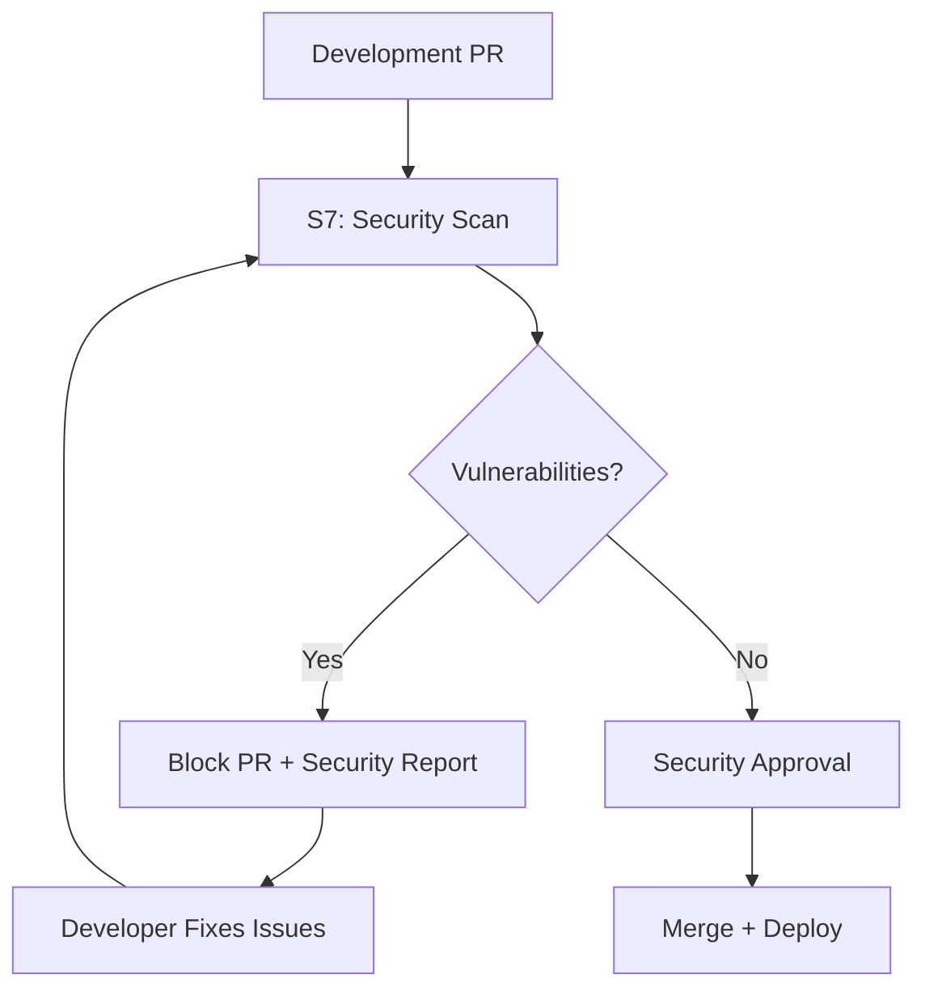

# 🔐 Security Expert Agent S7 - Implementierungsguide

## 📋 Übersicht

Agent S7 (Security-Expert) ist ein spezialisierter Sub-Agent im Multi-Agent-System, der für die umfassende Sicherheit der Booking-Anwendung verantwortlich ist. Er implementiert moderne DevSecOps-Praktiken und automatisierte Security-Workflows.

## 🎯 Kernfunktionen

### 1. Automatisierte Security-Scans
- **SAST (Static Application Security Testing)**
  - SonarQube für Code-Quality und Security
  - GitHub CodeQL für Deep-Semantic-Analysis  
  - Semgrep für Pattern-based Security Issues
  
- **DAST (Dynamic Application Security Testing)**
  - OWASP ZAP für Runtime-Vulnerability-Scanning
  - Automatisierte API-Security-Tests
  
- **SCA (Software Composition Analysis)**
  - Snyk für Dependency-Vulnerability-Management
  - npm audit für Node.js Dependencies
  - OWASP Dependency Check für umfassende SCA

### 2. DevSecOps Integration
- **CI/CD Security Gates**
  - Automatische Security-Scans bei jedem PR
  - Quality Gates blockieren unsichere Deployments
  - Security-Metrics und Trend-Monitoring

- **Container Security**
  - Trivy für Container-Image-Scanning
  - Docker Scout Integration
  - Dockerfile Security Best Practices

### 3. Compliance & Standards
- **Security Standards**
  - OWASP Top 10 Compliance
  - SANS Top 25 CWE Mitigation
  - GDPR Privacy-by-Design

## 🛠 Technische Implementierung

### Agent-Konfiguration
```yaml
Agent-ID: S7
Rolle: security-expert
Spezialisierungen:
  - SAST
  - DAST  
  - Vulnerability Management
  - DevSecOps
  - Compliance

Ports (Sub-Agent S7):
  - Frontend: 60701
  - Backend: 60702
  - Database: 60703
  - Claude Integration: 60704
  - SonarQube: 60705
  - OWASP ZAP: 60706
```

### Docker-Setup
```bash
# Agent S7 starten
./scripts/start-sub-agent.sh S7 feat/83-security-expert-sub-agent security-expert 83

# Mit Security-Tools
docker compose -f docker-compose.sub-agentS7.yml --profile security-tools up -d
```

### Security-Toolchain
```yaml
SAST_Tools:
  - SonarQube: Code Quality + Security Analysis
  - CodeQL: Semantic Security Analysis  
  - Semgrep: Pattern-based Vulnerability Detection

DAST_Tools:
  - OWASP_ZAP: Dynamic Web Application Security Testing
  - Custom API Security Tests

SCA_Tools:
  - Snyk: Dependency Vulnerability Management
  - npm_audit: Node.js Package Security
  - OWASP_Dependency_Check: Multi-language SCA

Container_Security:
  - Trivy: Container Image Vulnerability Scanning
  - Docker_Scout: Docker Security Scanning

Secret_Detection:
  - GitLeaks: Git Repository Secret Scanning
```

## 🔧 GitHub Actions Integration

### PR Security Workflow
```yml
# .github/workflows/security-scan-pr.yml
- SAST Analysis (CodeQL)
- Dependency Scanning (Snyk)  
- Container Security (Trivy)
- Secret Detection (GitLeaks)
- Security Quality Gate

Ergebnis: ✅/❌ Security Approval für PR
```

### Daily Security Monitoring
```yml
# .github/workflows/security-daily-scan.yml
- Comprehensive Security Health Check
- OWASP Dependency Check
- Container Security Benchmarking
- Security Metrics Collection
- Automated Security Dashboard Update
```

## 📊 Security Metrics & KPIs

### Vulnerability Management
- **MTTD (Mean Time to Detection)**: < 24h
- **MTTR (Mean Time to Remediation)**: 
  - Critical: < 24h
  - High: < 7d
  - Medium: < 30d
- **Vulnerability Density**: < 1 Critical per 10k LOC

### Security Coverage
- **Code Coverage**: > 80% security-relevanter Code
- **OWASP Top 10**: 100% Coverage
- **Dependency Freshness**: < 30 Tage veraltete Dependencies
- **Secret Detection**: 0 Credentials im Repository

## 🤝 Multi-Agent Koordination

### Security Reviews für andere Agents
- **Agent S1 (Senior Developer)**: Architecture Security Reviews
- **Agent S2 (UI Developer)**: Frontend Security (XSS, CSP)
- **Agent S3 (UX Expert)**: Security UX (2FA, Privacy)
- **Agent S4 (Test Expert)**: Security Test Automation
- **Agent S5 (Architecture)**: Threat Modeling
- **Agent S6 (DevOps)**: Infrastructure Security

### Security-First Workflow


## 🔒 Security Policies

### Code Security Standards
```typescript
// ✅ Secure Authentication
const jwt = {
  secret: process.env.JWT_SECRET, // Never hardcode!
  expiresIn: '15m',
  algorithm: 'HS256'
};

// ✅ Input Validation
const validateInput = (data) => {
  return Joi.object({
    email: Joi.string().email().required(),
    password: Joi.string().min(12).required()
  }).validate(data);
};

// ✅ SQL Injection Prevention (EF Core)
var booking = await context.BookingReadModels
  .Where(b => b.Id == bookingId) // Parameterized
  .FirstOrDefaultAsync();
```

### Quality Gates
```json
{
  "security_rating": "A",           // Muss A sein
  "vulnerabilities": 0,             // Keine Vulnerabilities
  "security_hotspots": 0,           // Keine Security Hotspots
  "coverage": ">= 80%",             // Min. 80% Coverage
  "duplicated_lines": "<= 3%"       // Max. 3% Duplikation
}
```

## 🚀 Erste Schritte

### 1. Agent S7 Setup
```bash
# Security-Expert Agent starten
cd /path/to/booking-project
./scripts/start-sub-agent.sh S7 feat/security-implementation security-expert

# Services verfügbar unter:
# - Frontend: http://localhost:60701
# - Backend: http://localhost:60702  
# - SonarQube: http://localhost:60705
# - OWASP ZAP: http://localhost:60706
```

### 2. Security-Scan ausführen
```bash
# Comprehensive Security Scan
docker compose -f docker-compose.sub-agentS7.yml exec security-scanner-S7 security-scanner

# Oder im Container
docker compose -f docker-compose.sub-agentS7.yml exec security-scanner-S7 bash
python3 /usr/local/bin/security-scanner
```

### 3. Security Dashboard
```bash
# Security Health Dashboard
open http://localhost:60705  # SonarQube
open http://localhost:60706  # OWASP ZAP

# Security Reports
ls /security/reports/
```

## 📚 Erweiterte Features

### Custom Security Rules
- **Semgrep Custom Rules**: `/security/config/semgrep-rules.yml`
- **SonarQube Quality Gate**: `/security/config/sonarqube-quality-gate.json`
- **Dependency Suppressions**: `/security/config/dependency-check-suppressions.xml`

### Security Automation
- **PR Security Checks**: Automatisch bei jedem PR
- **Daily Security Scans**: Tägliche umfassende Scans
- **Security Dashboard**: Live-Updates der Security-Metriken
- **Incident Response**: Automatische Issue-Erstellung bei kritischen Findings

### Compliance Reporting
- **OWASP Top 10**: Automatische Compliance-Checks
- **SANS Top 25**: CWE-basierte Vulnerability-Analyse
- **GDPR**: Privacy-by-Design Validierung

## 🔍 Troubleshooting

### Häufige Probleme
```bash
# Security-Scanner läuft nicht
docker compose -f docker-compose.sub-agentS7.yml logs security-scanner-S7

# SonarQube nicht erreichbar
docker compose -f docker-compose.sub-agentS7.yml restart sonarqube-S7

# Port-Konflikte
netstat -tuln | grep 607
```

### Performance-Optimierung
- **Parallel Scans**: Mehrere Tools parallel ausführen
- **Incremental Scans**: Nur geänderte Dateien scannen
- **Caching**: Tool-Results zwischen Scans cachen

## 📈 Roadmap

### Phase 1 (Aktuell)
- ✅ Agent S7 Setup und Konfiguration
- ✅ SAST/DAST/SCA Integration
- ✅ GitHub Actions Security Workflows
- ✅ Docker-Security-Environment

### Phase 2 (Geplant)
- [ ] Advanced Threat Modeling
- [ ] Security Metrics Dashboard
- [ ] Integration mit externen Security-Tools
- [ ] Security Training für andere Agents

### Phase 3 (Future)
- [ ] ML-based Vulnerability Prediction
- [ ] Automated Security Patching
- [ ] Advanced Compliance Reporting
- [ ] Security Chaos Engineering

---

## 🎯 Fazit

Security Expert Agent S7 transformiert die Booking-Anwendung von reaktiver zu proaktiver Security. Durch automatisierte Scans, DevSecOps-Integration und kontinuierliches Monitoring wird eine echte Security-First-Kultur etabliert.

**🔐 Security ist kein Feature, sondern eine Mentalität - Agent S7 macht diese Mentalität zur gelebten Realität.**