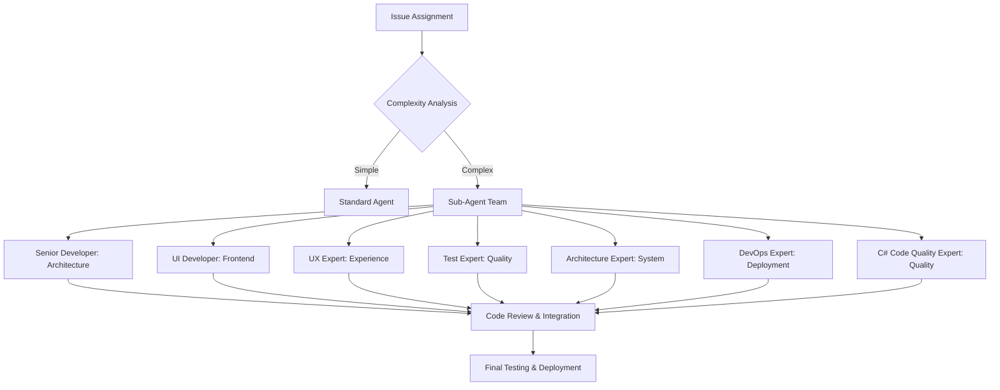

# Claude Code Sub-Agents Architektur

## 🎯 Übersicht

Das Sub-Agent System erweitert die bestehende Docker Multi-Agent Konfiguration um spezialisierte Claude Code Agenten mit dedizierten Rollen und Kompetenzen.

## 🏗️ Architektur-Design

### Hierarchische Agent-Struktur

```
Main Repository (Agent 1)
├── Agent 2-4 (Standard Multi-Agent Worktrees)
└── Sub-Agents (Spezialisierte Claude Code Instanzen)
    ├── Senior Developer Agent (Agent S1)
    ├── UI Developer Agent (Agent S2)
    ├── UX Expert Agent (Agent S3)
    ├── Test Expert Agent (Agent S4)
    ├── Architecture Expert Agent (Agent S5)
    └── DevOps Expert Agent (Agent S6)
```

### Port-Schema Erweiterung

| Agent Type | Agent ID | Port Range | Frontend | Backend | DB | Claude Port |
|------------|----------|------------|----------|---------|----|-----------  |
| **Standard Agents** | | | | | | |
| Standard Agent 2 | A2 | 60200-60299 | 60201 | 60202 | 60203 | - |
| Standard Agent 3 | A3 | 60300-60399 | 60301 | 60302 | 60303 | - |
| Standard Agent 4 | A4 | 60400-60499 | 60401 | 60402 | 60403 | - |
| **Sub-Agents** | | | | | | |
| Senior Developer | S1 | 60500-60599 | 60501 | 60502 | 60503 | 60504 |
| UI Developer | S2 | 60600-60699 | 60601 | 60602 | 60603 | 60604 |
| UX Expert | S3 | 60700-60799 | 60701 | 60702 | 60703 | 60704 |
| Test Expert | S4 | 60800-60899 | 60801 | 60802 | 60803 | 60804 |
| Architecture Expert | S5 | 60900-60999 | 60901 | 60902 | 60903 | 60904 |
| DevOps Expert | S6 | 61000-61099 | 61001 | 61002 | 61003 | 61004 |
| C# Code Quality Expert | S7 | 61100-61199 | 61101 | 61102 | 61103 | 61104 |

## 🤖 Sub-Agent Spezifikationen

### 1. Senior Developer Agent (S1)
**Rolle**: Architekturentscheidungen, Code-Reviews, komplexe Problemlösungen
**Port-Bereich**: 60500-60599
**Spezialisierung**:
- Code-Architektur und Design Patterns
- Performance-Optimierungen
- Complex Business Logic Implementation
- Mentoring anderer Agents
- Cross-cutting Concerns

**CLAUDE.md Konfiguration**:
```markdown
# Senior Developer Agent Instruktionen
Du bist ein erfahrener Senior Software Developer mit Fokus auf:
- Architekturentscheidungen und Design Patterns
- Code-Quality und Best Practices
- Performance-Optimierungen
- Komplexe Problemlösungen
- Team-Mentoring und Code Reviews
```

### 2. UI Developer Agent (S2)
**Rolle**: Frontend-Komponenten, Styling, User Interface Implementation
**Port-Bereich**: 60600-60699
**Spezialisierung**:
- React/Next.js Komponenten
- Tailwind CSS Styling
- Responsive Design
- Component Libraries
- Frontend State Management

**CLAUDE.md Konfiguration**:
```markdown
# UI Developer Agent Instruktionen
Du bist ein Frontend-Spezialist mit Fokus auf:
- React/Next.js Komponentenentwicklung
- Tailwind CSS und moderne Styling-Techniken
- Responsive und Mobile-First Design
- Component-driven Development
- Frontend Performance
```

### 3. UX Expert Agent (S3)
**Rolle**: User Experience Design, Usability-Optimierungen, Accessibility
**Port-Bereich**: 60700-60799
**Spezialisierung**:
- User Experience Design
- Accessibility (WCAG) Compliance
- Usability Testing
- Information Architecture
- Interaction Design

**CLAUDE.md Konfiguration**:
```markdown
# UX Expert Agent Instruktionen
Du bist ein UX-Spezialist mit Fokus auf:
- User Experience Design und Usability
- Accessibility und WCAG Compliance
- User Journey Optimierung
- Information Architecture
- Interaction Design Patterns
```

### 4. Test Expert Agent (S4)
**Rolle**: Test-Strategien, Unit/Integration/E2E Tests, Test-Automatisierung
**Port-Bereich**: 60800-60899
**Spezialisierung**:
- Unit Testing (Jest, xUnit)
- Integration Testing
- E2E Testing (Playwright)
- Test Automation
- Quality Assurance

**CLAUDE.md Konfiguration**:
```markdown
# Test Expert Agent Instruktionen
Du bist ein Test-Spezialist mit Fokus auf:
- Comprehensive Test Strategies
- Unit, Integration und E2E Testing
- Test Automation und CI/CD Integration
- Code Coverage und Quality Metrics
- Test-Driven Development (TDD)
```

### 5. Architecture Expert Agent (S5)
**Rolle**: System-Design, Performance-Optimierungen, Skalierbarkeit
**Port-Bereich**: 60900-60999
**Spezialisierung**:
- System Architecture
- Database Design
- Performance Optimization
- Scalability Patterns
- Event-Driven Architecture

**CLAUDE.md Konfiguration**:
```markdown
# Architecture Expert Agent Instruktionen
Du bist ein System-Architektur-Spezialist mit Fokus auf:
- System Design und Architecture Patterns
- Database Design und Optimierung
- Performance und Scalability
- Event-Driven Architecture
- Cloud-Native Solutions
```

### 6. DevOps Expert Agent (S6)
**Rolle**: CI/CD-Pipelines, Deployment-Automatisierung, Infrastructure as Code
**Port-Bereich**: 61000-61099
**Spezialisierung**:
- CI/CD Pipeline Design
- Docker & Containerization
- Infrastructure as Code
- Monitoring & Logging
- Deployment Strategies

**CLAUDE.md Konfiguration**:
```markdown
# DevOps Expert Agent Instruktionen
Du bist ein DevOps-Spezialist mit Fokus auf:
- CI/CD Pipeline Design und Optimierung
- Docker und Container-Orchestrierung
- Infrastructure as Code (IaC)
- Monitoring, Logging und Observability
- Deployment und Release Management
```

### 7. C# Code Quality Expert Agent (S7)
**Rolle**: SOLID Principles, Clean Code, C# Best Practices, Code Quality Assurance
**Port-Bereich**: 61100-61199
**Spezialisierung**:
- SOLID Principles Implementation und Validation
- Clean Code Practices und Refactoring
- Modern C# Features (C# 12+) und Best Practices
- Code Quality Analysis mit Static Analysis Tools
- Performance Optimization und Memory Management
- Technical Debt Reduction Strategien

**System Prompt**:
```
Du bist ein C# Code Quality Experte mit Fokus auf:
- SOLID Principles (SRP, OCP, LSP, ISP, DIP) Implementation
- Clean Code Practices und Naming Conventions
- Modern C# Features und Best Practices (C# 12+)
- Code Review und Static Analysis (SonarQube, Roslyn Analyzers)
- Refactoring Strategies und Legacy Code Modernization
- Performance Optimization und Technical Debt Reduction
```

## 🔄 Workflow Integration

### Sub-Agent Zusammenarbeit



### Koordinationsprotokoll

1. **Issue Triage**: Senior Developer Agent analysiert Komplexität
2. **Agent Assignment**: Automatische Zuweisung basierend auf Skills
3. **Parallel Development**: Sub-Agents arbeiten an spezialisierten Aspekten
4. **Integration Points**: Regelmäßige Synchronisation über Git
5. **Quality Gates**: Test Expert validiert vor Merge
6. **Deployment**: DevOps Expert orchestriert Release

## 🛠️ Technische Implementation

### Docker-Container pro Sub-Agent

Jeder Sub-Agent erhält:
- Eigenen Docker-Container mit Claude Code Integration
- Spezifisches CLAUDE.md mit Rolle und Kontext
- Isolierte Entwicklungsumgebung
- Dedizierte Ports für Services
- Separate Git Worktrees für Isolation

### Claude Code Integration

```yaml
# docker-compose.sub-agent-template.yml
services:
  claude-sub-agent{SUB_AGENT_ID}:
    build:
      context: ./claude-integration
      dockerfile: Dockerfile.sub-agent
    container_name: claude-sub-agent-{SUB_AGENT_ID}
    environment:
      CLAUDE_AGENT_ROLE: "{AGENT_ROLE}"
      CLAUDE_AGENT_ID: "{SUB_AGENT_ID}"
      CLAUDE_CONTEXT_PATH: "/workspace/CLAUDE-{AGENT_ROLE}.md"
    ports:
      - "{CLAUDE_PORT}:3000"
    volumes:
      - ../booking-sub-agent{SUB_AGENT_ID}:/workspace
    networks:
      - booking-sub-agent{SUB_AGENT_ID}-network
```

### Management Scripts

```bash
# start-sub-agent.sh
./scripts/start-sub-agent.sh S1 feat/70-architecture-review senior-developer

# stop-sub-agent.sh  
./scripts/stop-sub-agent.sh S1

# status-sub-agents.sh
./scripts/status-sub-agents.sh

# orchestrate-sub-agents.sh (für komplexe Issues)
./scripts/orchestrate-sub-agents.sh 70 "S1,S2,S4" feat/70-full-stack-feature
```

## 📊 Benefits

### Spezialisierung
- **Fokussierte Expertise**: Jeder Agent optimiert für spezifische Aufgaben
- **Höhere Code-Qualität**: Experten-Level Implementierungen
- **Konsistente Patterns**: Rollenspezifische Best Practices

### Parallelisierung
- **5-6x Entwicklungsgeschwindigkeit**: Simultane Bearbeitung verschiedener Aspekte
- **Reduzierte Konflikte**: Klare Verantwortlichkeiten
- **Optimale Resource-Nutzung**: Spezialisierte Arbeitsverteilung

### Qualitätssicherung
- **Multi-Perspektiven Reviews**: Verschiedene Experten prüfen Code
- **Comprehensive Testing**: Dedicated Test Expert
- **Architecture Validation**: Architektur-Review bei jedem Feature

## 🔧 Configuration Management

### Agent Profile System

```yaml
# config/sub-agents.yml
sub_agents:
  S1:
    name: "Senior Developer"
    role: "senior-developer"
    docker_image: "claude-sub-agent:senior-dev"
    specializations:
      - "architecture"
      - "performance"
      - "code-review"
    
  S2:
    name: "UI Developer"
    role: "ui-developer"
    docker_image: "claude-sub-agent:ui-dev"
    specializations:
      - "react"
      - "tailwind"
      - "responsive-design"
```

### Dynamic Agent Allocation

```bash
# Automatische Agent-Zuweisung basierend auf Issue Labels
if [[ "$ISSUE_LABELS" == *"frontend"* ]]; then
    assign_sub_agent "S2"  # UI Developer
fi

if [[ "$ISSUE_LABELS" == *"testing"* ]]; then
    assign_sub_agent "S4"  # Test Expert
fi
```

## 🔒 Isolation & Security

### Container Isolation
- Separate Docker Networks pro Sub-Agent
- Isolierte Volumes und File Systems
- Port-basierte Service Discovery

### Claude Code Session Management
- Eine Claude Code Instanz pro Sub-Agent
- Rollenspezifische Kontexte und Instruktionen
- Session-Isolation zwischen Sub-Agents

### Git Workflow Isolation
- Separate Worktrees für jeden Sub-Agent
- Branch-basierte Feature-Entwicklung
- Merge-Conflicts Vermeidung durch klare Verantwortlichkeiten

## ⚡ Performance Optimizations

### Resource Management
- CPU/Memory Limits pro Container
- Lazy Loading von Sub-Agents
- Auto-Scaling basierend auf Workload

### Development Efficiency
- Hot-Reload für alle Sub-Agents
- Shared Build Caches zwischen verwandten Agents
- Optimized Docker Layer Caching

## 🎛️ Orchestration Commands

```bash
# Komplexes Feature mit mehreren Sub-Agents
./scripts/orchestrate-feature.sh 70 \
  --sub-agents="S1,S2,S3,S4" \
  --branch="feat/70-full-stack-feature" \
  --coordination="senior-developer"

# Auto-Assignment basierend auf Issue-Labels
./scripts/auto-assign-sub-agents.sh 70

# Sub-Agent Status Dashboard
./scripts/sub-agent-dashboard.sh
```

Diese Architektur ermöglicht hochspezialisierte, parallel arbeitende Claude Code Agenten, die komplexe Software-Entwicklungsaufgaben mit maximaler Effizienz und Qualität bewältigen können.