```mermaid
graph TB
    subgraph "External Traffic"
        USERS[Users]
        CLAUDE[Claude API]
        GITHUB[GitHub Registry]
    end
    
    subgraph "Kubernetes Cluster"
        subgraph "Ingress Layer"
            NGINX[NGINX Ingress Controller]
            CERT[Cert Manager]
        end
        
        subgraph "Application Tier"
            subgraph "Standard Agents"
                A2F[Agent 2 Frontend]
                A2B[Agent 2 Backend]
                A3F[Agent 3 Frontend]
                A3B[Agent 3 Backend]
                A4F[Agent 4 Frontend]
                A4B[Agent 4 Backend]
            end
            
            subgraph "Claude Sub-Agents"
                S1[S1: Senior Developer<br/>HPA: 1-8 replicas]
                S2[S2: UI Developer<br/>HPA: 1-6 replicas]
                S3[S3: UX Expert<br/>HPA: 1-4 replicas]
                S4[S4: Test Expert<br/>HPA: 1-6 replicas]
                S5[S5: Architecture Expert<br/>HPA: 1-6 replicas]
                S6[S6: DevOps Expert<br/>HPA: 1-5 replicas]
            end
        end
        
        subgraph "Data Tier"
            subgraph "Agent Databases"
                DB2[(PostgreSQL<br/>Agent 2)]
                DB3[(PostgreSQL<br/>Agent 3)]
                DB4[(PostgreSQL<br/>Agent 4)]
            end
            
            subgraph "Sub-Agent Databases"
                DBS1[(PostgreSQL<br/>Sub S1)]
                DBS2[(PostgreSQL<br/>Sub S2)]
                DBS3[(PostgreSQL<br/>Sub S3)]
                DBS4[(PostgreSQL<br/>Sub S4)]
                DBS5[(PostgreSQL<br/>Sub S5)]
                DBS6[(PostgreSQL<br/>Sub S6)]
            end
        end
        
        subgraph "Infrastructure Tier"
            subgraph "Monitoring"
                PROM[Prometheus]
                GRAF[Grafana]
                ALERT[AlertManager]
            end
            
            subgraph "Logging"
                FLUENT[Fluent Bit]
                ELASTIC[Elasticsearch]
                KIBANA[Kibana]
            end
            
            subgraph "Auto-Scaling"
                HPA[Horizontal Pod Autoscaler]
                VPA[Vertical Pod Autoscaler]
                METRICS[Metrics Server]
            end
        end
        
        subgraph "GitOps"
            ARGO[ArgoCD / Flux]
        end
    end
    
    subgraph "Storage"
        PV[Persistent Volumes]
        SC[Storage Classes]
    end
    
    %% External connections
    USERS --> NGINX
    CLAUDE --> S1
    CLAUDE --> S2
    CLAUDE --> S3
    CLAUDE --> S4
    CLAUDE --> S5
    CLAUDE --> S6
    GITHUB --> ARGO
    
    %% Ingress routing
    NGINX --> A2F
    NGINX --> A3F
    NGINX --> A4F
    NGINX --> GRAF
    NGINX --> KIBANA
    
    %% Application connections
    A2F --> A2B
    A3F --> A3B
    A4F --> A4B
    
    A2B --> DB2
    A3B --> DB3
    A4B --> DB4
    
    S1 --> DBS1
    S2 --> DBS2
    S3 --> DBS3
    S4 --> DBS4
    S5 --> DBS5
    S6 --> DBS6
    
    %% Monitoring connections
    PROM --> A2B
    PROM --> A3B
    PROM --> A4B
    PROM --> S1
    PROM --> S2
    PROM --> S3
    PROM --> S4
    PROM --> S5
    PROM --> S6
    PROM --> DB2
    PROM --> DB3
    PROM --> DB4
    
    GRAF --> PROM
    ALERT --> PROM
    
    %% Logging connections
    FLUENT --> ELASTIC
    KIBANA --> ELASTIC
    
    %% Auto-scaling connections
    HPA --> METRICS
    VPA --> METRICS
    HPA --> S1
    HPA --> S2
    HPA --> S3
    HPA --> S4
    HPA --> S5
    HPA --> S6
    
    %% Storage connections
    DB2 --> PV
    DB3 --> PV
    DB4 --> PV
    DBS1 --> PV
    DBS2 --> PV
    DBS3 --> PV
    DBS4 --> PV
    DBS5 --> PV
    DBS6 --> PV
    PROM --> PV
    ELASTIC --> PV
```

# Booking System Kubernetes Architecture

## 🏗️ System Architecture Overview

This document provides a comprehensive overview of the Kubernetes architecture for the booking multi-agent system, designed to enable unlimited parallel Claude Code instances while maintaining functionality and improving scalability.

## 📊 Architecture Diagram



## 🧩 Component Architecture

### 1. Ingress Layer

#### NGINX Ingress Controller
- **Purpose**: Routes external traffic to internal services
- **Features**: SSL termination, load balancing, path-based routing
- **Configuration**: 
  - Host-based routing for different agents
  - SSL certificates via cert-manager
  - Rate limiting and DDoS protection

```yaml
# Example ingress configuration
apiVersion: networking.k8s.io/v1
kind: Ingress
metadata:
  name: booking-agent2-ingress
  annotations:
    kubernetes.io/ingress.class: "nginx"
    cert-manager.io/cluster-issuer: "letsencrypt-prod"
spec:
  tls:
  - hosts:
    - booking-agent2.example.com
    secretName: booking-agent2-tls
  rules:
  - host: booking-agent2.example.com
    http:
      paths:
      - path: /api
        pathType: Prefix
        backend:
          service:
            name: booking-agent2-backend-service
            port:
              number: 80
      - path: /
        pathType: Prefix
        backend:
          service:
            name: booking-agent2-frontend-service
            port:
              number: 3000
```

### 2. Application Tier

#### Standard Booking Agents

Each standard agent (agent2, agent3, agent4) consists of:

| Component | Technology | Replicas | Resources |
|-----------|------------|----------|-----------|
| **Frontend** | Next.js | 2 | 200m CPU, 512Mi RAM |
| **Backend** | .NET Core API | 2 | 500m CPU, 1Gi RAM |

**Key Features:**
- Stateless design for horizontal scaling
- Health checks for reliability
- Service mesh ready
- Prometheus metrics exposure

#### Claude Sub-Agents

Specialized agents with role-based scaling:

| Agent | Role | Min/Max Replicas | Resource Profile |
|-------|------|------------------|-----------------|
| **S1** | Senior Developer | 1-8 | High (2 CPU, 4Gi RAM) |
| **S2** | UI Developer | 1-6 | Medium (1.5 CPU, 3Gi RAM) |
| **S3** | UX Expert | 1-4 | Low (1 CPU, 2Gi RAM) |
| **S4** | Test Expert | 1-6 | Medium (1.5 CPU, 3Gi RAM) |
| **S5** | Architecture Expert | 1-6 | High (2 CPU, 4Gi RAM) |
| **S6** | DevOps Expert | 1-5 | Medium (1.5 CPU, 3Gi RAM) |

**Scaling Logic:**
```yaml
# Example HPA configuration for S1
apiVersion: autoscaling/v2
kind: HorizontalPodAutoscaler
metadata:
  name: booking-sub-s1-hpa
spec:
  scaleTargetRef:
    apiVersion: apps/v1
    kind: Deployment
    name: booking-sub-s1
  minReplicas: 1
  maxReplicas: 8
  metrics:
  - type: Resource
    resource:
      name: cpu
      target:
        type: Utilization
        averageUtilization: 70
  - type: Pods
    pods:
      metric:
        name: claude_api_requests_per_second
      target:
        type: AverageValue
        averageValue: "10"
```

### 3. Data Tier

#### Database Architecture

**Design Principle**: Database per Agent Isolation

Each agent has its own PostgreSQL instance to ensure:
- Data isolation and security
- Independent scaling
- Fault isolation
- Simplified backup/restore

```yaml
# Example StatefulSet for Agent 2 Database
apiVersion: apps/v1
kind: StatefulSet
metadata:
  name: booking-agent2-postgres
spec:
  serviceName: booking-agent2-postgres-headless
  replicas: 1
  template:
    spec:
      containers:
      - name: postgres
        image: postgres:16-alpine
        env:
        - name: POSTGRES_DB
          value: booking_agent2
        - name: POSTGRES_USER
          valueFrom:
            secretKeyRef:
              name: booking-system-secrets
              key: POSTGRES_USER
        volumeMounts:
        - name: postgres-storage
          mountPath: /var/lib/postgresql/data
  volumeClaimTemplates:
  - metadata:
      name: postgres-storage
    spec:
      accessModes: ["ReadWriteOnce"]
      storageClassName: fast-ssd
      resources:
        requests:
          storage: 20Gi
```

#### Storage Classes

| Storage Class | Performance | Use Case | Example |
|---------------|-------------|----------|---------|
| **fast-ssd** | High IOPS | Agent databases | Booking data |
| **standard** | Standard | Sub-agent DBs | Session data |
| **backup** | Low cost | Backups | Archive data |

### 4. Infrastructure Tier

#### Monitoring Stack

**Prometheus + Grafana + AlertManager**

```yaml
# Prometheus configuration for booking system
global:
  scrape_interval: 15s
  evaluation_interval: 15s

scrape_configs:
# Standard agents
- job_name: 'booking-agents'
  kubernetes_sd_configs:
  - role: pod
    namespaces:
      names: [booking-system]
  relabel_configs:
  - source_labels: [__meta_kubernetes_pod_label_app]
    action: keep
    regex: booking-agent.*

# Claude sub-agents
- job_name: 'claude-sub-agents'
  kubernetes_sd_configs:
  - role: pod
    namespaces:
      names: [booking-system]
  relabel_configs:
  - source_labels: [__meta_kubernetes_pod_label_app]
    action: keep
    regex: booking-sub-.*

# PostgreSQL instances
- job_name: 'postgres-cluster'
  kubernetes_sd_configs:
  - role: pod
    namespaces:
      names: [booking-system]
  relabel_configs:
  - source_labels: [__meta_kubernetes_pod_label_app]
    action: keep
    regex: .*postgres.*
```

**Key Metrics Collected:**
- Application: Request rate, response time, error rate
- Infrastructure: CPU, memory, disk, network
- Claude API: Token usage, API latency, quota limits
- Database: Connections, query performance, replication lag

#### Logging Stack

**Fluent Bit + Elasticsearch + Kibana**

```yaml
# Fluent Bit configuration
[INPUT]
    Name              tail
    Path              /var/log/containers/booking-*.log
    Parser            docker
    Tag               booking.*

[INPUT]
    Name              tail
    Path              /var/log/containers/claude-*.log
    Parser            docker
    Tag               claude.*

[FILTER]
    Name                kubernetes
    Match               booking.*
    Kube_URL            https://kubernetes.default.svc:443
    Merge_Log           On
    K8S-Logging.Parser  On

[OUTPUT]
    Name            es
    Match           *
    Host            elasticsearch-service
    Port            9200
    Index           booking-system-logs
    Logstash_Format On
```

### 5. Auto-Scaling Architecture

#### Horizontal Pod Autoscaler (HPA)

**Standard Scaling Metrics:**
- CPU utilization (70% threshold)
- Memory utilization (80% threshold)

**Custom Scaling Metrics:**
- Claude API requests per second
- Queue length per sub-agent
- Context token utilization
- Response time percentiles

#### Vertical Pod Autoscaler (VPA)

**Resource Optimization:**
- Automatic resource recommendation
- Right-sizing based on actual usage
- Cost optimization
- Performance optimization

```yaml
# VPA example for Sub-Agent S1
apiVersion: autoscaling.k8s.io/v1
kind: VerticalPodAutoscaler
metadata:
  name: booking-sub-s1-vpa
spec:
  targetRef:
    apiVersion: apps/v1
    kind: Deployment
    name: booking-sub-s1
  updatePolicy:
    updateMode: "Auto"
  resourcePolicy:
    containerPolicies:
    - containerName: claude-agent
      minAllowed:
        cpu: 200m
        memory: 256Mi
      maxAllowed:
        cpu: 4000m
        memory: 8Gi
```

### 6. GitOps Architecture

#### ArgoCD Integration

**Application Structure:**
```yaml
# ArgoCD Application for booking system
apiVersion: argoproj.io/v1alpha1
kind: Application
metadata:
  name: booking-system
  namespace: argocd
spec:
  project: default
  source:
    repoURL: https://github.com/andrekirst/booking.git
    targetRevision: main
    path: k8s
  destination:
    server: https://kubernetes.default.svc
    namespace: booking-system
  syncPolicy:
    automated:
      prune: true
      selfHeal: true
```

**Branch Strategy:**
- `main`: Production deployments
- `develop`: Staging deployments  
- `feature/*`: Development deployments (manual)

## 🔧 Network Architecture

### Service Mesh Considerations

While not implemented initially, the architecture is prepared for service mesh integration:

```yaml
# Istio readiness annotations
metadata:
  annotations:
    sidecar.istio.io/inject: "true"
    traffic.sidecar.istio.io/includeInboundPorts: "3000,8080"
```

### Network Policies

```yaml
# Example network policy for booking system
apiVersion: networking.k8s.io/v1
kind: NetworkPolicy
metadata:
  name: booking-system-netpol
  namespace: booking-system
spec:
  podSelector: {}
  policyTypes:
  - Ingress
  - Egress
  ingress:
  # Allow ingress controller
  - from:
    - namespaceSelector:
        matchLabels:
          name: ingress-nginx
  # Allow internal communication
  - from:
    - podSelector: {}
  egress:
  # Allow DNS
  - to: []
    ports:
    - protocol: UDP
      port: 53
  # Allow external APIs (Claude, etc.)
  - to: []
    ports:
    - protocol: TCP
      port: 443
```

## 🔒 Security Architecture

### Pod Security Standards

```yaml
# Namespace security configuration
apiVersion: v1
kind: Namespace
metadata:
  name: booking-system
  labels:
    pod-security.kubernetes.io/enforce: restricted
    pod-security.kubernetes.io/audit: restricted
    pod-security.kubernetes.io/warn: restricted
```

### RBAC Model

**Service Account Permissions:**
- `booking-system-sa`: Application runtime permissions
- `booking-system-admin`: Administrative access
- `booking-system-readonly`: Read-only monitoring access

### Secrets Management

**Secret Types:**
- **Database credentials**: PostgreSQL authentication
- **API keys**: Claude API authentication
- **TLS certificates**: SSL/TLS termination
- **Monitoring credentials**: Grafana, Prometheus access

## 📈 Scalability Design

### Horizontal Scaling Limits

| Component | Min | Max | Scaling Trigger |
|-----------|-----|-----|----------------|
| Standard Agent Frontend | 2 | 5 | CPU > 70% |
| Standard Agent Backend | 2 | 5 | CPU > 70% |
| Sub-Agent S1 (Senior Dev) | 1 | 8 | API req/s > 10 |
| Sub-Agent S2 (UI Dev) | 1 | 6 | API req/s > 8 |
| Sub-Agent S3 (UX Expert) | 1 | 4 | API req/s > 6 |
| Sub-Agent S4 (Test Expert) | 1 | 6 | API req/s > 12 |
| Sub-Agent S5 (Arch Expert) | 1 | 6 | API req/s > 6 |
| Sub-Agent S6 (DevOps Expert) | 1 | 5 | API req/s > 8 |

### Vertical Scaling

**Resource Profiles:**
- **Small**: 100m CPU, 128Mi RAM (Sub-agent S3)
- **Medium**: 500m CPU, 1Gi RAM (Standard agents)
- **Large**: 2000m CPU, 4Gi RAM (Sub-agent S1, S5)

### Storage Scaling

**Volume Expansion:**
- Automatic expansion enabled
- Monitor disk usage via Prometheus
- Alert at 80% capacity
- Auto-expand at 85% capacity

## 🚀 Performance Optimization

### Application-Level Optimizations

**Caching Strategy:**
```yaml
# Redis cache for read models
apiVersion: apps/v1
kind: Deployment
metadata:
  name: redis-cache
spec:
  replicas: 2
  template:
    spec:
      containers:
      - name: redis
        image: redis:7-alpine
        resources:
          requests:
            cpu: 100m
            memory: 256Mi
```

**Database Optimizations:**
- Connection pooling
- Read replicas for heavy queries
- Partitioning for large tables
- Regular VACUUM and ANALYZE

### Infrastructure-Level Optimizations

**Node Affinity:**
```yaml
# Database pods on SSD nodes
spec:
  affinity:
    nodeAffinity:
      requiredDuringSchedulingIgnoredDuringExecution:
        nodeSelectorTerms:
        - matchExpressions:
          - key: storage-type
            operator: In
            values: ["ssd"]
```

**Pod Anti-Affinity:**
```yaml
# Distribute replicas across nodes
spec:
  affinity:
    podAntiAffinity:
      preferredDuringSchedulingIgnoredDuringExecution:
      - weight: 100
        podAffinityTerm:
          labelSelector:
            matchExpressions:
            - key: app
              operator: In
              values: ["booking-agent2"]
          topologyKey: kubernetes.io/hostname
```

## 🔄 Disaster Recovery

### Backup Strategy

**Database Backups:**
- Daily full backups
- Hourly incremental backups
- Cross-region replication
- Point-in-time recovery

**Application State:**
- GitOps repository as source of truth
- Container image backups
- Configuration backups

### Recovery Procedures

**RTO/RPO Targets:**
- RTO: 15 minutes
- RPO: 1 hour

**Recovery Steps:**
1. Assess impact and scope
2. Restore database from backup
3. Deploy application from GitOps
4. Verify functionality
5. Route traffic back

## 📊 Monitoring and Observability

### SLIs and SLOs

**Service Level Indicators:**
- Availability: 99.9%
- Response time: p95 < 500ms
- Error rate: < 0.1%
- Claude API success rate: > 99%

**Alerting Rules:**
```yaml
# High error rate alert
- alert: HighErrorRate
  expr: rate(http_requests_total{status=~"5.."}[5m]) > 0.01
  for: 5m
  labels:
    severity: critical
  annotations:
    summary: "High error rate detected"

# Claude API slow response
- alert: SlowClaudeAPI
  expr: claude_api_response_time_seconds > 30
  for: 2m
  labels:
    severity: warning
  annotations:
    summary: "Claude API response time is slow"
```

## 🔮 Future Enhancements

### Planned Improvements

1. **Service Mesh Integration**
   - Istio for advanced traffic management
   - mTLS for secure communication
   - Distributed tracing

2. **Multi-Region Deployment**
   - Cross-region disaster recovery
   - Geographic load balancing
   - Data locality compliance

3. **AI-Driven Scaling**
   - Predictive scaling based on usage patterns
   - Machine learning for resource optimization
   - Intelligent workload placement

4. **Advanced Security**
   - OPA Gatekeeper policies
   - Image vulnerability scanning
   - Runtime security monitoring

---

*This architecture document is maintained by the Architecture team and updated with each major release.*